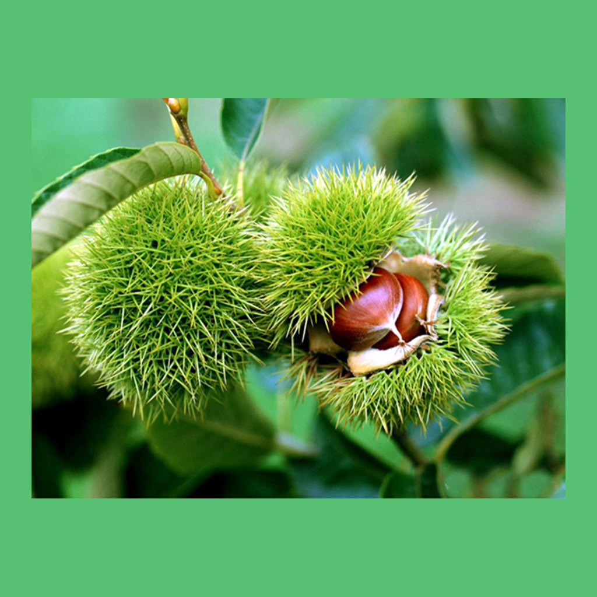

## Welcome to My Chestnut  Picking Records

Do you like chestnuts? They grow on trees. They are full of chestnuts. After processing, they will become very delicious food. If you also like chestnuts, then this app will help you to make all kinds of chestnuts. You can keep track of each trip to pick chestnuts from different areas, when they were picked, how much they were harvested and how they felt afterwards. You can analyze the different kinds of chestnuts according to your own list, so that you can better enjoy the delicious chestnuts.

If you have any questions, you can either leave a message or send the questions to our email address.

We will answer them for you in the first time.

### Address: sun778297ma@163.com

Thank you!
